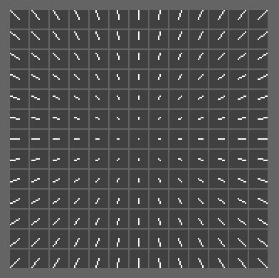

## Drawing Fewer Lines

To reduce the number of lines being drawn while retaining the pixel perfect ellipse shape we pre-calculate a static tree structure that encodes all possible straight line renderings from a fixed starting point. To limit the size of the tree, we limit the length of the straight lines.

### Making the Tree
In particular, consider a 13x13 grid of pixels with origin at the centre. Coordinates
range from (-6,-6) to (6,6).

We investigate the rendering of each straight line from (0,0) to some other point on
the grid. There are 13x13=169 of these straight lines:



We encode each pixel move along each line into a tree.

An edge of the tree represents a move in a particular direction from one pixel to the next along a straight line.

### Directions
We represent the directions from a point X to an adjacent pixel by a number 0-8 (The
number four is unused. This is an implementation detail to optimise the speed of the
code):
```
                    678
                    3X5
                    012
```
Figure A - encoding directions

Moving from the root of the tree is in one of eight directions.

However once an initial direction is chosen the straight line then has only three directions it can continue along (since straight lines don't turn 90 degrees). For instance, if the straight line starts in direction 0, then each following pixel move for that particular straight line is in one of the three directions (3,0,1) as seen in Figure A.

### Blue and Yellow nodes
Each node in the tree is coloured blue or yellow. If a node in the tree represents the final pixel of a straight line, then we colour it blue. Yellow nodes are the remainder - intermediate nodes part way towards longer line(s).

The resulting tree looks like this:


The root of the tree has eight children, corresponding to the eight directions that can be taken from the first pixel. Each subtree's nodes from this point onwards has at most three children.

By symmetry, we see that only the first three subtrees are unique. The remainder of the subtrees are identical to one of the first three, with suitable reordering of the directions.

### Drawing the Ellipse
We are attempting to optimise the runtime for drawing an ellipse. We have an algorithm that traces the pixels of an ellipse. Instead of drawing each pixel, we call a new routine.

Starting at the root of the tree, the routine will move a pointer from one node of the tree to one of it's children (if possible). If we run out of tree (the latest direction does not lead to a new child node), then we (a) draw the longest straight line so far enountered since the root (up to the last blue node), and (b) replay any remaining yellow node moves to the new routine.

### Implementation details
A python script (asm/create_table.py) is used to create the tree and output the appropriate data (asm/linedata.a).

There are 93 nodes in the symmetry reduced tree, so each node can be identified by a single byte.

Each node of the tree stores three children and blue/yellow flag (four bytes total).
For speed, we store these values in four separate arrays of bytes 'child0', 'child1',
'child2', and 'isBlue'. A value of 255 means no child is present.

Children of the root
The root of the tree is a special case as is has eight children, which is reduced to three due to symmetry as noted above. We store a mapping from the eight possible initial directions to the root of one of the three unique subtrees. We also store the three possible continuing directions for the subtree for each initial direction.

### Limitations
Different operating systems can render straight lines in slightly different ways. This will affect the data produced. So the data is OS specific.

### Future Development ###
This technique is not just useful for ellipses, but can be used with any shape that's drawn using adjacent pixels.

#### Optimisations
Large or squashed ellipses can have long sections of purely vertical or horizontal lines. At the moment these lines are encoded into multiple lines of length 7. It is possible to adjust the tree data so that e.g. the child of node along a vertical line can point to it's parent. This turns our tree into a graph that can encode vertical and horizontal lines of any length. Similarly for diagonal (45 degree) lines and perhaps some other regular lines too.

We can coalesce identical parts of the tree to save memory.

We can move the isBlue flag into the top bit of e.g. child0, to save memory.
